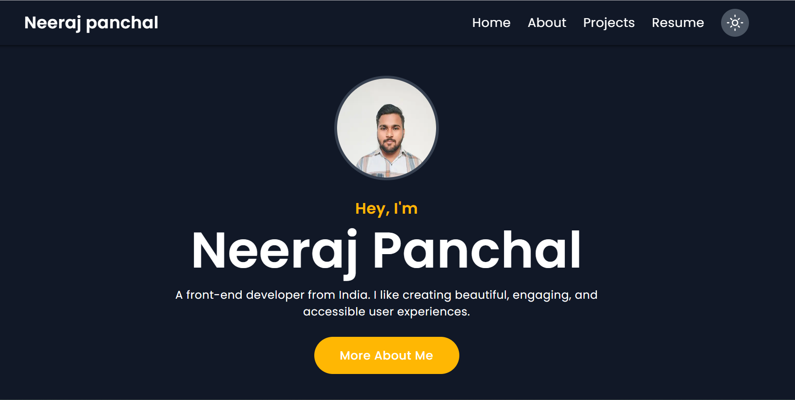

<a href="https://my-portfolio-sand-pi-62.vercel.app/about"><h1 align="center">Neeraj panchal</h1></a>



My portfolio built with Next.js and Tailwind CSS. It is available in light as well as in dark themes.

:point_right: **See it [live](https://my-portfolio-sand-pi-62.vercel.app/about)**

## :rocket: Quick start

```bash
# clone repo
git clone https://github.com/neerajpanchal004/My-portfolio.git

# changing directory
cd portfolio-site

# installing dependencies
npm install

# starting development server
npm run dev
```

## Technologies Used

- [Next.js](https://nextjs.org/)
- [Tailwind CSS](https://tailwindcss.com/)
- [Vercel](https://vercel.com/)

